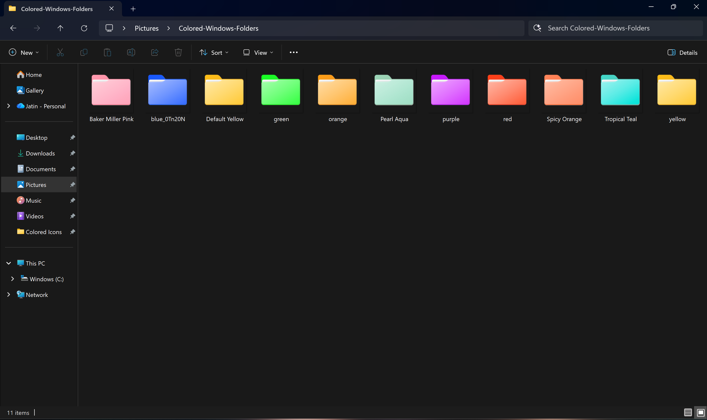

# Custom Windows 11 Folder Icons

A collection of custom-colored folder icons to organize and beautify your Windows 11 desktop.

## 📂 What's Inside?
- **ICO Files:** Ready-to-use icons for Windows.

## 🚀 How to Use
1. Click the green **Code** button above and select **Download ZIP**.
2. Extract the folder to a safe place (e.g., `Documents\Icons`).
3. Right-click the folder you want to change -> **Properties**.
4. Go to **Customize** -> **Change Icon...** -> **Browse**.
5. Select the `.ico` file from the downloaded folder.

## 🎨 Credits
Designed using Canva. Free for personal use.
